# 🏋️‍♂️ FitGlow - Next-Gen Fitness & Coaching Platform

[](https://flutter.dev/)
[](https://dart.dev/)
[](https://pub.dev/packages/flutter_bloc)
[](#license)

**FitGlow** is a modern, cross-platform mobile and web application built with **Flutter** that bridges the gap between personal fitness coaches and clients. It provides a complete digital ecosystem for tracking workouts, customizing nutrition plans, managing client-coach requests, scheduling training sessions, and leveraging AI-powered fitness assistance.

---

## 📌 Table of Contents

- [✨ Key Features](#-key-features)
- [👥 User Roles](#-user-roles)
  - [🏋️‍♂️ Coach Role](#️-coach-role)
  - [🏃‍♂️ Client Role](#️-client-role)
- [📸 Screenshots Showcase](#-screenshots-showcase)
  - [Coach Experience](#coach-experience)
  - [Client Experience](#client-experience)
- [🛠️ Tech Stack & Architecture](#️-tech-stack--architecture)
- [📂 Project Directory Structure](#-project-directory-structure)
- [🚀 Local Setup & Installation](#-local-setup--installation)
- [📡 Backend & API Integration](#-backend--api-integration)
- [🤝 Contributing & License](#-contributing--license)

---

## ✨ Key Features

- **Dual-Role Architecture**: Specialized workflows and dashboards tailored for both **Coaches** and **Clients**.
- **Interactive Onboarding & Assessment**: Customized profile onboarding capturing fitness goals, experience levels, training locations, and dietary preferences.
- **Workout & Fitness Hub**: Exercise library with interactive video player, category filtering, and workout intensity tracking.
- **Nutrition & Meal Management**: Calorie tracking, macro breakdown, and customized meal plan creation.
- **Coach-Client Connectivity**: Direct booking system, request management, and real-time chat.
- **AI Fitness Assistant**: AI-powered chatbot (`AIChatCubit`) providing instant workout advice and meal recommendations.
- **Gym Store & Merch Hub**: Built-in store browsing, shopping cart, and order checkout flow.

---

## 👥 User Roles

### 🏋️‍♂️ Coach Role
- **Coach Dashboard**: View active client numbers, pending training requests, daily schedule, and activity metrics.
- **Client Management**: Filter and review clients, view details, switch between active clients and training requests.
- **Coach Profile & Credentials**: Show experience years, ratings, specialization tags (Weight Loss, Muscle Gain, etc.), and bio details.
- **Custom Plan Creation**: Design tailored workout routines and nutrition meal plans for individual clients.
- **Client Communication**: Instant messaging and notification dispatching to active trainees.

### 🏃‍♂️ Client Role
- **Client Dashboard & Profile**: Detailed physical stats (age, weight, height), saved items, progress chart, and subscription plan status.
- **AI Fitness Assistant**: Interactive AI Coach chatbot for instant workout planning and nutrition guidance.
- **Coach Directory & Booking**: Browse top-rated coaches, view detailed profiles, check availability, and book sessions.
- **Progress & Metrics Tracker**: Log weight, body measurements, and fitness progress over time.
- **Workout Execution**: Step-by-step exercise guides with interactive progress logs.
- **Store & Checkout**: Purchase fitness gear, supplements, and digital plans.

---

## 📸 Screenshots Showcase

### Coach Experience

| Coach Dashboard | Coach Profile | Client Management |
| :---: | :---: | :---: |
| 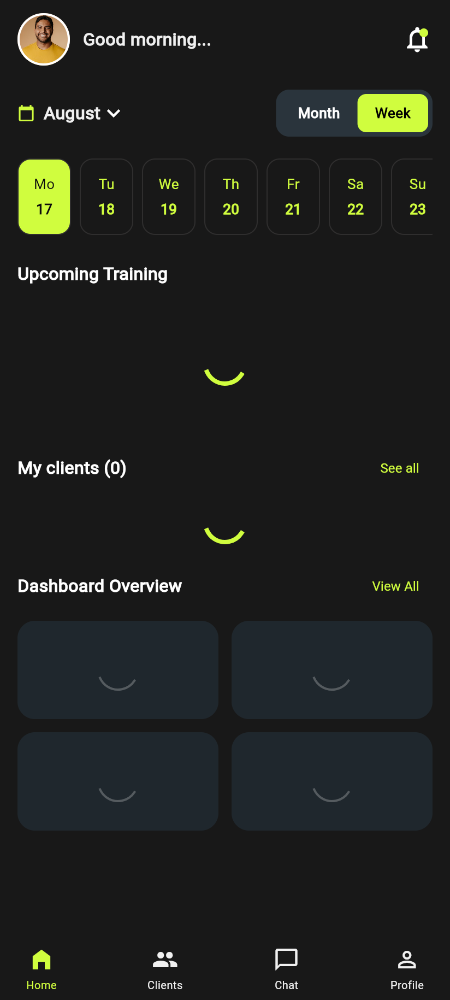 | 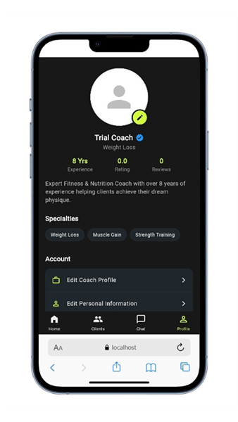 | 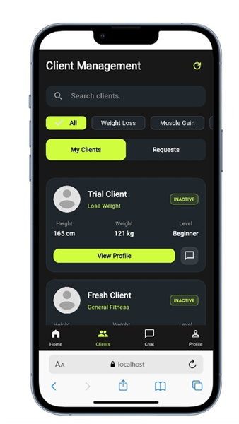 |

| Direct Client Chat | Role Selection |
| :---: | :---: |
| 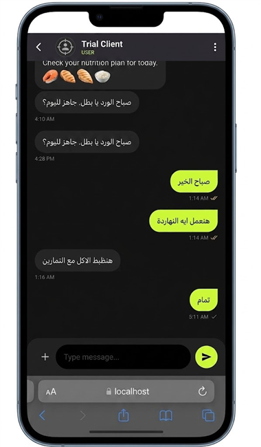 | 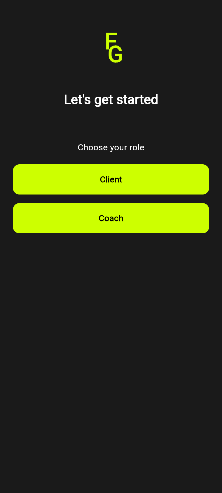 |

---

### Client Experience

| Workout Library | Nutrition Library |
| :---: | :---: |
| 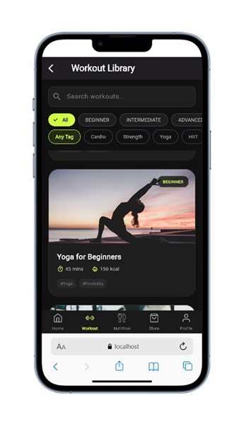 | 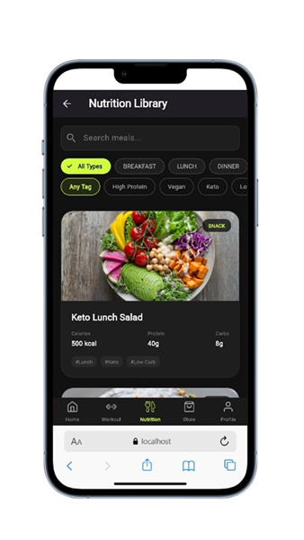 |

| Gym Store Product | Shopping Cart & Checkout |
| :---: | :---: |
| 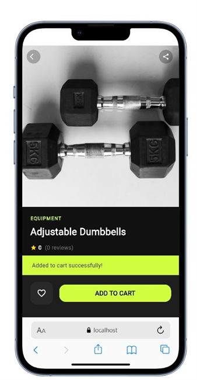 | 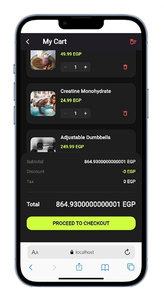 |

| Client Profile | AI Fitness Coach Chat |
| :---: | :---: |
| 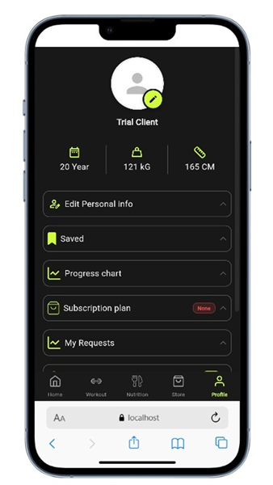 | 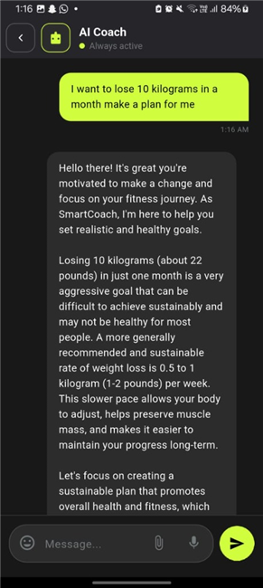 |

---

## 🛠️ Tech Stack & Architecture

- **Framework**: [Flutter](https://flutter.dev/) (SDK ^3.10.0)
- **Language**: [Dart](https://dart.dev/)
- **State Management**: Dual architecture using `flutter_bloc` (Cubit pattern) and `provider`
- **Networking & API**: `dio` (^5.9.2) & `http` (^1.6.0) for RESTful API services
- **UI Components**:
  - `google_fonts` (Poppins & modern typography)
  - `flutter_svg` for crisp vector assets
  - `fl_chart` for progress charts and analytics
  - `shimmer` for skeleton loading states
  - `lottie` for animations
- **Local Storage**: `shared_preferences` (^2.5.4)

---

## 📂 Project Directory Structure

```text
FitGlow/
├── android/                   # Android native configuration
├── ios/                       # iOS native configuration
├── web/                       # Web entrypoint and platform assets
├── screenshots/               # Application screenshot showcase
│   ├── coach/                 # Coach flow screenshots
│   └── client/                # Client flow screenshots
├── assets/                    # Platform icons and app logos
├── lib/
│   ├── assets/                # App images, vector graphics, and icons
│   ├── logic/
│   │   └── cubits/            # BLoC/Cubit state management (Chat, Workout, Store, Nutrition)
│   ├── models/                # Data models (Client, Coach, Workout, Order, Request)
│   ├── providers/             # Provider state classes (SubscriptionProvider)
│   ├── screens/               # UI Screens
│   │   ├── client/            # Client-specific screens (Booking, Progress, Requests)
│   │   ├── coach/             # Coach-specific screens (Requests, Plans, Chats, Schedule)
│   │   ├── nutrition/         # Meal and diet plan views
│   │   ├── profile/           # Profile edit & personal details
│   │   ├── store/             # Gym store & checkout screens
│   │   └── workout/           # Exercise player & workout categories
│   ├── services/              # API and backend service layers (User, Coach, Chat, Store)
│   ├── widgets/               # Reusable UI widgets
│   └── main.dart              # Application entry point & route definitions
├── pubspec.yaml               # Package dependencies & asset declarations
└── README.md                  # Repository documentation
```

---

## 🚀 Local Setup & Installation

### Prerequisites

- [Flutter SDK](https://docs.flutter.dev/get-started/install) (v3.10.0 or higher)
- [Dart SDK](https://dart.dev/get-started)
- Android Studio / VS Code with Flutter extension

### Step-by-Step Setup

1. **Clone the Repository**:
   ```bash
   git clone https://github.com/kholoudragheb/FitGlow.git
   cd FitGlow
   ```

2. **Install Dependencies**:
   ```bash
   flutter pub get
   ```

3. **Run the Application**:
   - For **Chrome (Web)**:
     ```bash
     flutter run -d chrome
     ```
   - For **Android / iOS Device**:
     ```bash
     flutter run
     ```
   - For **Windows Desktop**:
     ```bash
     flutter run -d windows
     ```

---

## 📡 Backend & API Integration

FitGlow interfaces with a RESTful backend API service using **Dio** and HTTP clients located in `lib/services/`.

- **User Authentication**: Login, Sign Up, OTP Verification, Password Reset.
- **Coach & Client Services**: Fetching coach availability, submitting coaching requests, managing client logs.
- **Workout & Store APIs**: Fetching workout categories, exercise details, store products, and processing orders.

---

## 📄 License

Distributed under the MIT License. See `LICENSE` for more information.

---

<p align="center">
  Made with ❤️ for the Fitness Community by <b>FitGlow Team</b>.
</p>
